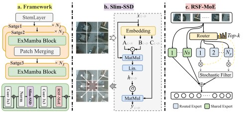

# ExMamba: Efficient Expert-Driven Mamba for Remote Sensing Perception

This repository contains the code implementation for the paper **"ExMamba: Efficient Expert-Driven Mamba for Remote Sensing Perception"**, which covers both semantic segmentation and object detection tasks for remote sensing imagery.

---

## Getting Started

After installing the required dependencies, you can start training by running:

```bash
python train.py configs

